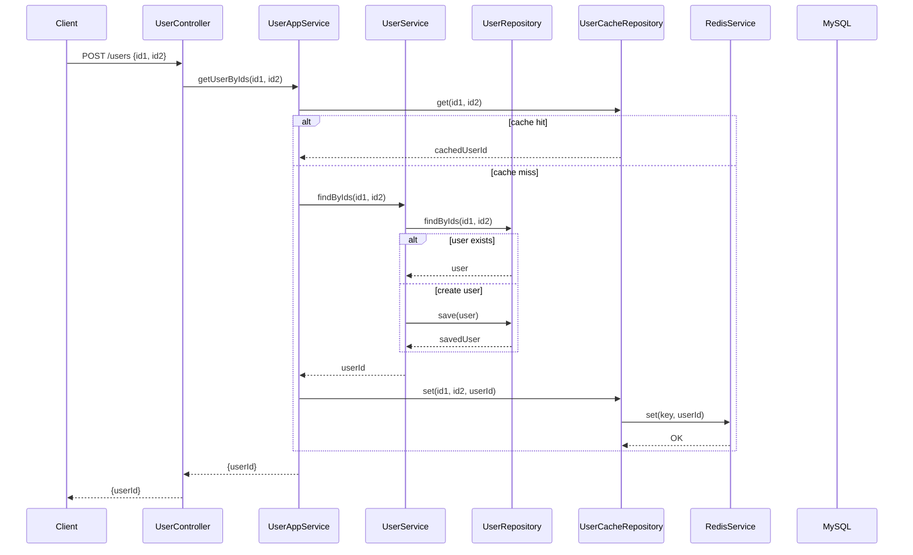

## Sequence Diagram



## Project setup

```bash
$ npm install
```

## Compile and run the project

```bash
# development
$ npm run start

# watch mode
$ npm run start:dev

# production mode
$ npm run start:prod
```

## Run tests

```bash
# unit tests
$ npm run test

# e2e tests
$ npm run test:e2e

# test coverage
$ npm run test:cov
```

### Test Coverage

The project includes comprehensive unit tests for all core services and repositories:

| Test Suite | Test Cases | Coverage |
|---|---|---|
| `UserService` | 1 test | Finds users by IDs and creates new users |
| `UserAppService` | 2 tests | Handles cache hits and misses |
| `UserRepository` | 2 tests | Queries and saves user entities |
| `UserCacheRepository` | 3 tests | Redis cache get/set operations |
| `RedisService` | 4 tests | Redis client operations with TTL |
| **Total** | **12 tests** | **5 test suites** |

**Current Results**: 5 passed, 12 tests, 0 failures

## Docker Setup

The project includes Docker support for containerized deployment. All services (NestJS app, MySQL, Redis) are orchestrated via Docker Compose.

### Prerequisites

- Docker & Docker Compose installed

### Quick Start with Docker

Run the included `run.sh` script to clean up old containers and start fresh:

```bash
$ chmod +x run.sh
$ ./run.sh
```

This script will:
1. Stop and remove all existing containers (`docker compose down`)
2. Build and start all services (`docker compose up --build`)

The application will be available at `http://localhost:3000`.

### Docker Compose Manual Control

Alternatively, manage containers manually:

```bash
# Start services in the foreground (see logs)
$ docker compose up --build

# Start services in the background
$ docker compose up -d --build

# Stop services
$ docker compose down

# View logs
$ docker compose logs -f
```

### Services

- **NestJS App**: Runs on port 3000
- **MySQL**: Runs on port 3306 (configured in `.env`)
- **Redis**: Runs on port 6379 (configured in `.env`)

### Build Details

- Multi-stage Dockerfile: builder stage compiles TypeScript, runtime stage runs optimized Node image
- Base image: `node:20-alpine` (lightweight, production-ready)
- Dev dependencies excluded in production build

## Deployment

When you're ready to deploy your NestJS application to production, there are some key steps you can take to ensure it runs as efficiently as possible. Check out the [deployment documentation](https://docs.nestjs.com/deployment) for more information.

If you are looking for a cloud-based platform to deploy your NestJS application, check out [Mau](https://mau.nestjs.com), our official platform for deploying NestJS applications on AWS. Mau makes deployment straightforward and fast, requiring just a few simple steps:

```bash
$ npm install -g @nestjs/mau
$ mau deploy
```

With Mau, you can deploy your application in just a few clicks, allowing you to focus on building features rather than managing infrastructure.

## License

Nest is [MIT licensed](https://github.com/nestjs/nest/blob/master/LICENSE).
